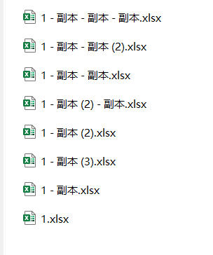
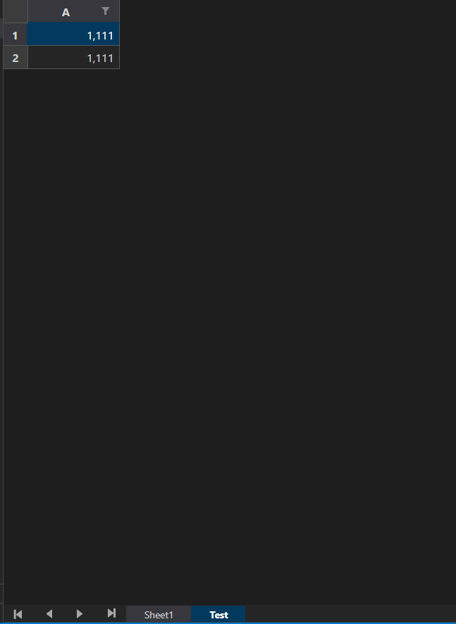

# Delete_EXCEL_SpSheet
delete special sheet

将待处理的表格放入process data文件夹下




每个表格中均存在名为`Test`的Sheet名

填好路径运行即可

## 环境
- 编辑器：vscode
- 编译器：python3.10.4

## 包
- openpyxl
- os

导入包


```python
import openpyxl
import os
```

新建一个列表用来存放路径

指定要删除的sheet名'Test'

在当前程序所在目录遍历xlsx，并取出文件名存入filelist


```python
filelist = []
sheet_name = 'Test'
for root, dirs, files in os.walk(".", topdown=False):
    for name in files:
        str = os.path.join(root, name)
        if str.split('.')[-1] == 'xlsx':
            filelist.append(str)

filelist
```


    ['.\\process data\\1 - 副本 (2) - 副本.xlsx',
     '.\\process data\\1 - 副本 (2).xlsx',
     '.\\process data\\1 - 副本 (3).xlsx',
     '.\\process data\\1 - 副本 - 副本 (2).xlsx',
     '.\\process data\\1 - 副本 - 副本 - 副本.xlsx',
     '.\\process data\\1 - 副本 - 副本.xlsx',
     '.\\process data\\1 - 副本.xlsx',
     '.\\process data\\1.xlsx']


对filelist进行循环

首先打开工作簿

然后得到要删除的工作表并调用remove方法移除

最后以原文件名保存

其中若误将不存在特定sheet的文件放入，做了优化提示


```python
for i in range(len(filelist)):
    workbook = openpyxl.load_workbook(filelist[i])
    # 删除目标Sheet
    if sheet_name in workbook:
        worksheet = workbook[sheet_name]
        workbook.save(filelist[i])
        workbook.remove(worksheet)
        print(filelist[i]+' delete successfully!')
    else:
        print(filelist[i]+'的指定Sheet不存在，故不作处理')
```

    .\process data\1 - 副本 (2) - 副本.xlsx的指定Sheet不存在，故不作处理
    .\process data\1 - 副本 (2).xlsx的指定Sheet不存在，故不作处理
    .\process data\1 - 副本 (3).xlsx的指定Sheet不存在，故不作处理
    .\process data\1 - 副本 - 副本 (2).xlsx的指定Sheet不存在，故不作处理
    .\process data\1 - 副本 - 副本 - 副本.xlsx的指定Sheet不存在，故不作处理
    .\process data\1 - 副本 - 副本.xlsx的指定Sheet不存在，故不作处理
    .\process data\1 - 副本.xlsx的指定Sheet不存在，故不作处理
    .\process data\1.xlsx delete successfully!
    
